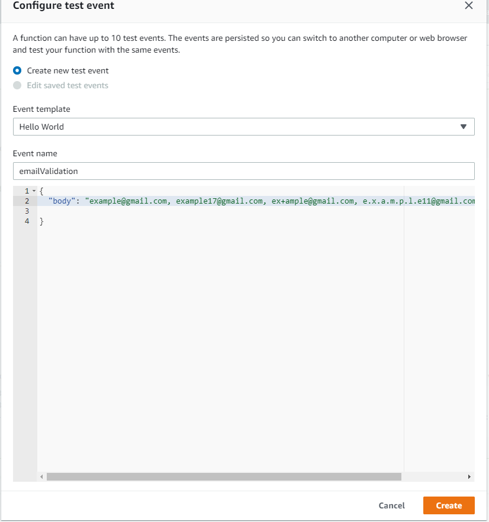

# Email Validator Using Spring Boot
## Problem Statement

Accept a list of email addresses and return an integer indicating the number of unique email addresses.
Where "unique" email addresses means they will be delivered to the same account using Gmail account matching. 

 
**Following are the constraints that I handled in my project-**
#### Character length
- Choose a username 6–30 characters long. Your username can be any combination of letters, numbers, or symbols.

#### Special characters
- Usernames can contain letters (a-z), numbers (0-9), and periods (.).
- Usernames cannot contain an ampersand (&), equals sign (=), underscore (_), apostrophe ('), dash (-), plus sign (+), comma (,), brackets (<,>), or more than one period (.) in a row.
- Usernames can begin or end with non-alphanumeric characters except periods (.). Other than this rule,

**Following are steps to create and run an executable jar-**

1) Write the following command in terminal at project folder level for creating the Jar- 

    `$mvn clean install`

2) To run a jar file use the following command

    `$java -jar target/jarname.jar`

###Deploy the executable jar of the project on AWS Elastic Beanstalk

Use AWS Cloud Elastic Beanstalk service to deploy Email validation project. 

Following are the configuration steps that I followed while creating the Elastic Beanstalk instance for Spring Boot application.

Step1:

Create a new environment under Elastic Beanstalk and enter the details 

Step2:

By default, spring boot runs on port 8080 and elastic beanstalk runs on 5000, we need to change one of the port number to synchronized and to make it functional. I am mapping 8080 port to 5000 using following configuration change tab inside software configuration tab.
Enter the environment properties set the following properties

`SERVER_PORT: 5000`

  

Below screenshot is when application is running successfully.

Below screenshot is showing the health of the website.

To verify successful deployment, I used postman to test my application’s post method as below- 

####Steps to deploy executable jar of the project on AWS Lambda

Following are the configuration steps for Lambda services and API Gateway for spring boot application.

Step1:

Go to AWS Lambda services and create a function. 

Steps 2:

After creating the function, click on the add trigger and configured the API Gateway.

Step 3:

Upload a jar file and set the java 8 as a runtime and also give the respective name for handler as per project structure. 

Step 4: 

To verify successful deployment, I used postman to test my application’s post method as follow. 

You can also test on AWS console. Click on the configure test events and write the inputs. 

After creating the sample test, click on the Test button and you can see below result.

